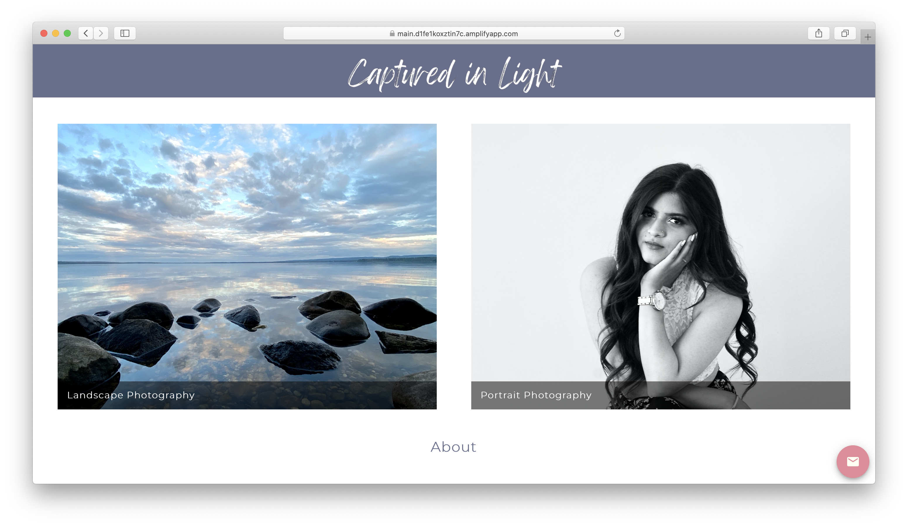
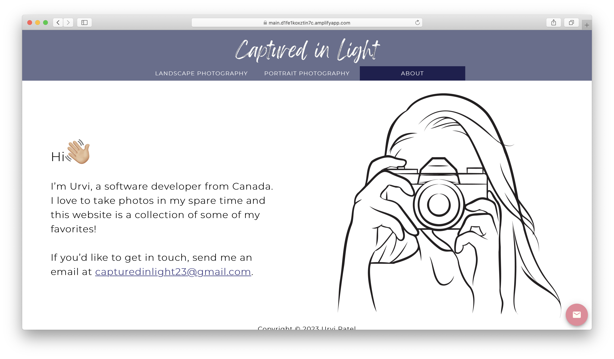

# photography-site

## Tech
- Frontend built with React
- Images stored on Firebase
- Deployed with AWS

## Captured in Light
**A website to display my photography portfolio.**

Find the deployed site here: https://main.d1fe1koxztin7c.amplifyapp.com/

### Landing Page

### Photography Page

### Landscape Photography Page

### Portrait Photography Page

### About Page

## Sources
Initial react boilerplate code: https://github.com/UAlberta-CMPUT401/react-boilerplate

Image in About Page: https://static.vecteezy.com/system/resources/previews/021/194/434/original/woman-holding-camera-line-drawing-vector.jpg

Wave animation in About Page:
https://codepen.io/jakejarvis/pen/pBZWZw 

